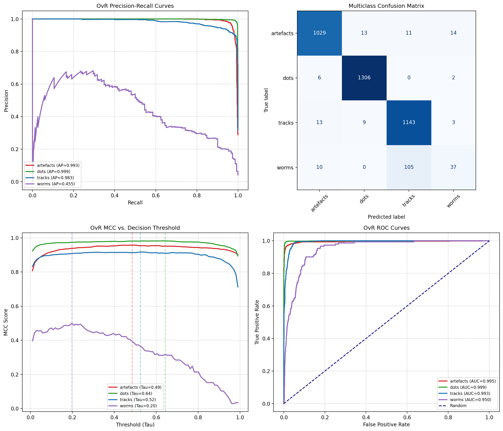

# CMOS Cosmic Ray & Muon Detector with a Neural Network Classifier

🌐 Live muon observatory link  [https://bkb3.github.io/muon-observatory/](https://bkb3.github.io/muon-observatory/)

Data updated everyday around UTC 00:00.

This implements a lightweight, high-speed Convolutional Neural Network (CNN) pipeline designed to classify cosmic ray and background radiation events captured by a light-sealed camera. Due to JavaScript restrictions on GitHub Pages, some items may appear as placeholders when the site is hosted there, even though they display correctly when run locally. Running locally is easy, just `git clone` this repo, then `uv sync` followed by `.venv/bin/activate` then `python detector_server.py`. Make sure your light sealed camera is UVC compliant.


By running independent Binary Cross-Entropy (BCE) multi-label thresholds, the pipeline effectively separates legitimate high-energy cosmic ray muons from low-energy radioactive decay electrons and sensor noise without letting dominant classes overpower rare events.

## 📸 Input Data Specifications
* **Training Source:** [credo-science](https://github.com/credo-science/image-data-set)

* ```
  --- Dataset Distribution Summary ---
  Class 'artefacts': 5335 images found
  Class 'dots': 6567 images found
  Class 'tracks': 5839 images found
  Class 'worms': 762 images found
  ```

* **Dimensions:** 60 × 60 pixels (single-channel grayscale patches).
* **Format:** Raw input values normalized down to a `[0.0, 1.0]` floating-point range.
* **Extraction:** Input images are tight, dynamically generated bounding-box crops around active pixel clusters that clear the sensor's baseline thermal noise floor.

## 🧠 Model Architecture (`MuonMiniCNN`)
See the [Jupyter notebook](CNN-bceloss.ipynb).

The classifier utilizes a compact, custom deep convolutional footprint optimized to run in low-power edge environments (like Raspberry Pi monitoring servers) using ONNX Runtime.
```
      Input Image [1, 60, 60]
                 │
      ┌──────────┴──────────┐
      │ Conv2d (3x3, 16ch)  │ ──► BatchNorm ──► ReLU ──► MaxPool (2x2)
      └──────────┬──────────┘
                 │  Downscaled to [16, 30, 30]
      ┌──────────┴──────────┐
      │ Conv2d (3x3, 32ch)  │ ──► BatchNorm ──► ReLU ──► MaxPool (2x2)
      └──────────┬──────────┘
                 │  Downscaled to [32, 15, 15]
      ┌──────────┴──────────┐
      │ Conv2d (3x3, 64ch)  │ ──► BatchNorm ──► ReLU
      └──────────┬──────────┘
                 │  Preserves 15x15 spatial resolution
      ┌──────────┴──────────┐
      │ AdaptiveAvgPool2d   │ ──► Flattens grid into [64] channel features
      └──────────┬──────────┘
                 │
      ┌──────────┴──────────┐
      │   Dropout (30%)     │ ──► Linear (64 ──► 4 Logits) ──► Sigmoid Output
      └─────────────────────┘
```

## 📈 Real-World Performance Metrics

The system was evaluated against a validation dataset containing 3,701 total unique events, achieving an **Overall Multiclass Matthews Correlation Coefficient (MCC) of 0.9273** and an **overall accuracy of 95%**.



The performance metrics can be understood as:

* **Cosmic Ray Muon Tracks:**
  * Out of every 100 predictions labeled as `TRACKS` by the system, **91 will be actual, verified cosmic ray muons**, while 9 will be straight radioactive scattering anomalies.
  * The network captures **98% of all true muon tracks** passing through the webcam sensor matrix.
* **Ambient Radioactive Background (Dots):**
  * The system achieves near-perfection on localized sensor impacts. Out of every 100 predictions labeled as `DOTS`, **98 are completely correct**. It detects **99% of all total dots** present in the signal stream.
* **Rare Background Electrons (Worms):**
  * Because low-energy electrons are highly rare and easily attenuated by spatial pooling, they are difficult to capture cleanly.
  * Out of 100 predictions labeled as `WORMS`, **66 will be real, curly electron tracks**. The network safely captures **24% of all total worm events** passing across the drive array, routing the remaining low-signal variants safely into the unverified noise bin.

## 🛠️ Dynamic One-vs-Rest Thresholding ($\tau$)

Standard multi-class systems force predictions to sum to 100%, causing the network to confidently guess a winner even on meaningless black pixels.

To prevent this, this pipeline scores each category completely independently using a Sigmoid layer. There's an optimization sweep across the validation data to locate the absolute best threshold cutoff ($\tau$) that maximizes the Matthews Correlation Coefficient for each individual target category.

```python
OPTIMAL_THRESHOLDS = {
    'artefacts': 0.49,  # High barrier to keep clear sensor errors locked out
    'dots'     : 0.64,  # High barrier to prevent bleeding into soft tracks
    'tracks'   : 0.52,  # Confident baseline to protect valid cosmic ray paths
    'worms'    : 0.20   # Dropped threshold to rescue faint, winding electron structures
}
```

### Conflict Resolution Strategy

When an active particle cluster clears multiple independent threshold gates simultaneously, the system evaluates the **Margin of Victory**:

$$\text{Margin} = \text{Sigmoid Probability} - \tau_{\text{class}}$$

The category that beats its optimized validation threshold by the largest absolute mathematical distance is awarded the final classification designation, preventing weak default assumptions.

## 🔍 Understanding Low Confidence Artifact Logs

You may occasionally see entries in `muon_log.csv` that look like this:
`2026-09-22 11:36:23 | Identified As: ARTEFACTS | Confidence: 6.53%`

### Why is the confidence score so low?

This project uses independent **Sigmoid channels** rather than a forced Softmax function. Every class is evaluated as an isolated binary question out of 100%. 

When an ambiguous frame arrives (for example, a weak, short track signature scoring 42% for `tracks` but missing its mandatory 52.4% validation threshold hurdle), **it fails to clear any category gates**. 

Because it fails all thresholds, the architecture safely rejects the event and defaults the frame classification to `ARTEFACTS`. The system then outputs the **literal probability of the artifact channel** (6.53%). 

A low percentage value does not mean the system is broken; it mathematically represents an **unclassifiable, near-noise event** that was successfully stopped at the gates by the validation rules.

